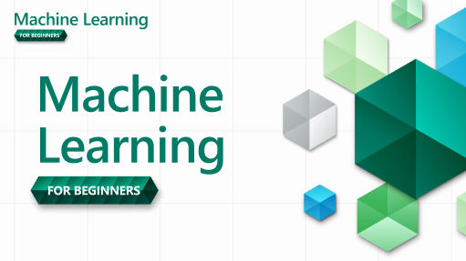
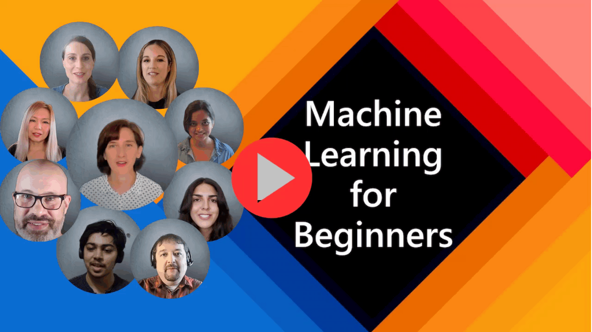

# 机器学习课程

> 在[microsoft/ML-For-Beginners](https://github.com/microsoft/ML-For-Beginners)的基础上，创建了中文在线学习网站[机器学习 在线教程 ](https://eanyang7.github.io/Machine-Learning/)

12周、26节课

在这套课程中，你将学习关于**经典机器学习**的内容，主要将使用 Scikit-learn 这一库。关于深度学习的内容将会尽量避免 —— 它会被我们即将推出的 "AI for Beginners (针对初学者的 AI 教程)" 所涵盖。你也可以把这些课和我们已推出的 [Data Science for Beginners（针对初学者的数据科学教程）](https://aka.ms/datascience-beginners) 相结合！

通过把这些经典的技术应用在来自世界各地的数据，我们将 “环游世界”。每一节课都包括了课前和课后测验、课程内容的文字讲义说明、示例代码、作业等。通过这种基于项目的教学方法，你将在构建中学习，这样可以把技能学得更牢靠。

---
# 准备开始

[**对于学生们**](https://aka.ms/student-page)，为了更好的使用这套课程，把整个仓库 fork 到你自己的 GitHub 账户中，并自行（或和一个小组一起）完成以下练习：

- 从课前测验开始
- 阅读课程内容，完成所有的活动，在每次 knowledge check 时暂停并思考
- 我们建议你基于理解来创建项目（而不是仅仅跑一遍示例代码）。示例代码的位置在每一个项目的 `/solution` 文件夹中。
- 进行课后测验
- 完成课程挑战
- 完成作业
- 一节课完成后, 访问[讨论版](https://github.com/microsoft/ML-For-Beginners/discussions)，通过填写相应的 PAT Rubric (课程目标) 来深化自己的学习成果。你也可以回应其它的 PAT，这样我们可以一起学习。

> 如果希望进一步学习，我们推荐跟随 [Microsoft Learn](https://docs.microsoft.com/en-us/users/jenlooper-2911/collections/k7o7tg1gp306q4?WT.mc_id=academic-77952-leestott) 的模块和学习路径。

---

## 视频演示 

有些课程以短格式的视频提供。您可以在课程中找到它们的链接，或点击下方图片，在[Microsoft Developer YouTube频道的“ML for Beginners”播放列表](https://aka.ms/ml-beginners-videos)中找到它们。

 

## 项目团队

> 🎥 点击上面的图片获取关于该项目和创建人员的视频！

---
## 教学方式

此课程基于两个教学原则：学生应该上手进行**项目实践**，并完成**频繁的测验**。 此外，为了使整个课程更具有整体性，课程们有一个共同的**主题**。

通过确保课程内容与项目强相关，我们让学习过程对学生更具吸引力，概念的学习也被深化了。难度较低的课前测验可以吸引学生学习课程，而课后的第二次测验也进一步重复了课堂中的概念。该课程被设计地灵活有趣，可以一次性全部学习，或者分开来一部分一部分学习。这些项目由浅入深，从第一周的小项目开始，在第十二周结束时变得较为复杂。本课程还包括一个关于机器学习实际应用的附言，可用作额外学分或进一步讨论的基础。

## 每一节课都包含：

- 可选的速写笔记
- 可选的补充视频
- 视频演示（仅适用于部分课程）
- 课前热身测验
- 文字课程
- 对于基于项目的课程，包含构建项目的分步指南
- 知识检测
- 一个挑战
- 补充阅读
- 作业
- 课后测验

> **关于测验**：所有的测验都在[这个应用里](https://gray-sand-07a10f403.1.azurestaticapps.net/)，总共 52 个测验，每个测验三个问题。它们的链接在每节课中，而且这个测验应用可以在本地运行。请参考 `quiz-app` 文件夹中的指南。

| 课程编号 |                     主体                     |                            课程组                            | 学习目标                                                     |                           课程链接                           |
| :------: | :------------------------------------------: | :----------------------------------------------------------: | ------------------------------------------------------------ | :----------------------------------------------------------: |
|    01    |                 机器学习简介                 |    [简介](https://eanyang7.github.io/Machine-Learning/1-Introduction/)    | 了解机器学习背后的基本概念                                   | [课程](https://eanyang7.github.io/Machine-Learning/1-Introduction/1-intro-to-ML/) |
|    02    |                机器学习的历史                |    [简介](https://eanyang7.github.io/Machine-Learning/1-Introduction/)    | 了解该领域的历史                                             | [课程](https://eanyang7.github.io/Machine-Learning/1-Introduction/2-history-of-ML/) |
|    03    |                机器学习与公平                |    [简介](https://eanyang7.github.io/Machine-Learning/1-Introduction/)    | 在构建和应用机器学习模型时，我们应该考虑哪些有关公平的重要哲学问题？ | [课程](https://eanyang7.github.io/Machine-Learning/1-Introduction/3-fairness/) |
|    04    |              机器学习的技术工具              |    [简介](https://eanyang7.github.io/Machine-Learning/1-Introduction/)    | 机器学习研究者使用哪些技术来构建机器学习模型？               | [课程](https://eanyang7.github.io/Machine-Learning/1-Introduction/4-techniques-of-ML/) |
|    05    |                   回归简介                   |     [回归](https://eanyang7.github.io/Machine-Learning/2-Regression/)     | 开始使用 Python 和 Scikit-learn 构建回归模型                 | [课程](https://eanyang7.github.io/Machine-Learning/2-Regression/1-Tools/) |
|    06    |                北美南瓜价格 🎃                |     [回归](https://eanyang7.github.io/Machine-Learning/2-Regression/)     | 可视化、进行数据清理，为机器学习做准备                       | [课程](https://eanyang7.github.io/Machine-Learning/2-Regression/2-Data/)  |
|    07    |                北美南瓜价格 🎃                |     [回归](https://eanyang7.github.io/Machine-Learning/2-Regression/)     | 建立线性和多项式回归模型                                     | [课程](https://eanyang7.github.io/Machine-Learning/2-Regression/3-Linear/) |
|    08    |                北美南瓜价格 🎃                |     [回归](https://eanyang7.github.io/Machine-Learning/2-Regression/)     | 构建逻辑回归模型                                             | [课程](https://eanyang7.github.io/Machine-Learning/2-Regression/4-Logistic/) |
|    09    |                一个网页应用 🔌                |    [网页应用](https://eanyang7.github.io/Machine-Learning/3-Web-App/)     | 构建一个 Web 应用程序以使用经过训练的模型                    | [课程](https://eanyang7.github.io/Machine-Learning/3-Web-App/1-Web-App/)  |
|    10    |                   分类简介                   |   [分类](https://eanyang7.github.io/Machine-Learning/4-Classification/)   | 清理、准备和可视化数据； 分类简介                            | [课程](https://eanyang7.github.io/Machine-Learning/4-Classification/1-Introduction/) |
|    11    |            美味的亚洲和印度美食 🍜            |   [分类](https://eanyang7.github.io/Machine-Learning/4-Classification/)   | 分类器简介                                                   | [课程](https://eanyang7.github.io/Machine-Learning/4-Classification/2-Classifiers-1/) |
|    12    |            美味的亚洲和印度美食 🍜            |   [分类](https://eanyang7.github.io/Machine-Learning/4-Classification/)   | 关于分类器的更多内容                                         | [课程](https://eanyang7.github.io/Machine-Learning/4-Classification/3-Classifiers-2/) |
|    13    |            美味的亚洲和印度美食 🍜            |   [分类](https://eanyang7.github.io/Machine-Learning/4-Classification/)   | 使用您的模型构建一个可以「推荐」的 Web 应用                  | [课程](https://eanyang7.github.io/Machine-Learning/4-Classification/4-Applied/) |
|    14    |                   聚类简介                   |     [聚类](https://eanyang7.github.io/Machine-Learning/5-Clustering/)     | 清理、准备和可视化数据； 聚类简介                            | [课程](https://eanyang7.github.io/Machine-Learning/5-Clustering/1-Visualize/) |
|    15    |          探索尼日利亚人的音乐品味 🎧          |     [聚类](https://eanyang7.github.io/Machine-Learning/5-Clustering/)     | 探索 K-Means 聚类方法                                        | [课程](https://eanyang7.github.io/Machine-Learning/5-Clustering/2-K-Means/) |
|    16    |          自然语言处理 (NLP) 简介  ☕️          |    [自然语言处理](https://eanyang7.github.io/Machine-Learning/6-NLP/)     | 通过构建一个简单的 bot (机器人) 来了解 NLP 的基础知识        | [课程](https://eanyang7.github.io/Machine-Learning/6-NLP/1-Introduction-to-NLP/) |
|    17    |              常见的 NLP 任务 ☕️               |    [自然语言处理](https://eanyang7.github.io/Machine-Learning/6-NLP/)     | 通过理解处理语言结构时所需的常见任务来加深对于自然语言处理 (NLP) 的理解 |              [课程](https://eanyang7.github.io/Machine-Learning/6-NLP/2-Tasks/)              |
|    18    |               翻译和情感分析 ♥️               |    [自然语言处理](https://eanyang7.github.io/Machine-Learning/6-NLP/)     | 对简·奥斯汀的文本进行翻译和情感分析                          |      [课程](https://eanyang7.github.io/Machine-Learning/6-NLP/3-Translation-Sentiment/)      |
|    19    |               欧洲的浪漫酒店 ♥️               |    [自然语言处理](https://eanyang7.github.io/Machine-Learning/6-NLP/)     | 对于酒店评价进行情感分析（上）                               |         [课程](https://eanyang7.github.io/Machine-Learning/6-NLP/4-Hotel-Reviews-1/)         |
|    20    |               欧洲的浪漫酒店 ♥️               |    [自然语言处理](https://eanyang7.github.io/Machine-Learning/6-NLP/)     | 对于酒店评价进行情感分析（下）                               |         [课程](https://eanyang7.github.io/Machine-Learning/6-NLP/5-Hotel-Reviews-2/)         |
|    21    |               时间序列预测简介               |   [时间序列](https://eanyang7.github.io/Machine-Learning/7-TimeSeries/)   | 时间序列预测简介 forecasting                                 |       [课程](https://eanyang7.github.io/Machine-Learning/7-TimeSeries/1-Introduction/)       |
|    22    | ⚡️ 世界用电量 ⚡️ - 使用 ARIMA 进行时间序列预测 |   [时间序列](https://eanyang7.github.io/Machine-Learning/7-TimeSeries/)   | 使用 ARIMA 进行时间序列预测                                  |          [课程](https://eanyang7.github.io/Machine-Learning/7-TimeSeries/2-ARIMA/)           |
|    23    |    ⚡️ 世界用电量⚡️ - 基于SVR的时间序列预测     |   [时间序列](https://eanyang7.github.io/Machine-Learning/7-TimeSeries/)   | 基于支持向量回归器的时间序列预测                             |           [课程](https://eanyang7.github.io/Machine-Learning/7-TimeSeries/3-SVR/)            |
|    23    |                 强化学习简介                 | [强化学习](https://eanyang7.github.io/Machine-Learning/8-Reinforcement/)  | Q-Learning 强化学习简介                                      | [课程](https://eanyang7.github.io/Machine-Learning/8-Reinforcement/1-QLearning/) |
|    24    |             帮助 Peter 避开狼！🐺             | [强化学习](https://eanyang7.github.io/Machine-Learning/8-Reinforcement/)  | 强化学习练习                                                 | [课程](https://eanyang7.github.io/Machine-Learning/8-Reinforcement/2-Gym/) |
|   附言   |        现实世界中的机器学习场景和应用        | [自然场景下的机器学习](https://eanyang7.github.io/Machine-Learning/9-Real-World/) | 探索有趣的经典机器学习方法，了解现实世界中机器学习的应用     |       [课程](https://eanyang7.github.io/Machine-Learning/9-Real-World/1-Applications/)       |
|   附言   |         使用RAI仪表板在ML中调试模型          | [自然场景下的机器学习](https://eanyang7.github.io/Machine-Learning/9-Real-World/) | 使用负责任的AI仪表板组件进行机器学习中的模型调试             |   [课程](https://eanyang7.github.io/Machine-Learning/9-Real-World/2-Debugging-ML-Models/)    |
## 离线访问

使用[Material for MkDocs ](https://squidfunk.github.io/mkdocs-material/)进行本地构建
## PDF 文档

点击[这里](https://eanyang7.github.io/Machine-Learning/pdf/readme.pdf)查找课程的 PDF 文档。

## 其他课程

- [AI](https://aka.ms/ai-beginners)
- [生成式AI](https://aka.ms/genai-beginners)
- [数据科学](https://aka.ms/datascience-beginners)
- [Web 开发](https://aka.ms/webdev-beginners)
